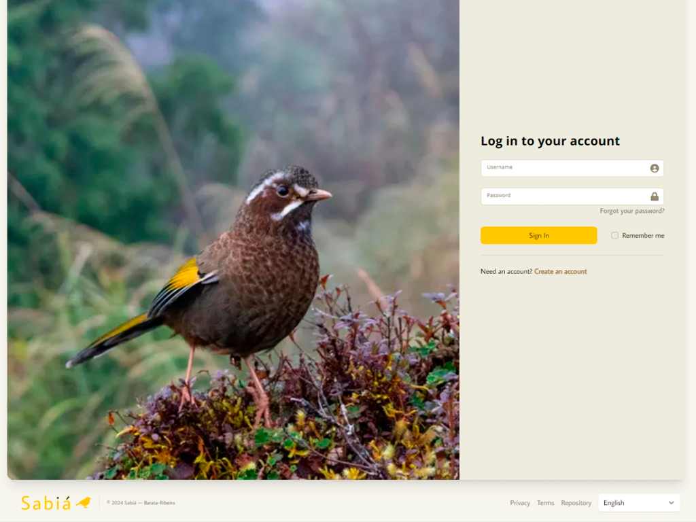
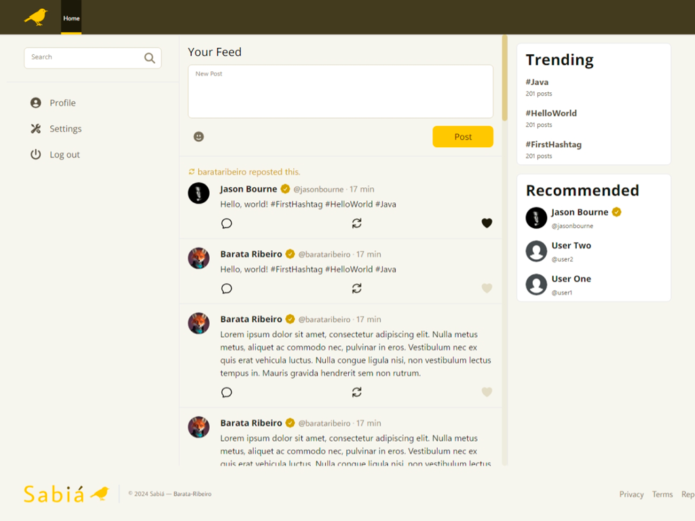

# Sabiá - Microblogging platform 🪶

Sabiá is a **full-stack** microblogging social network inspired by **X** (formerly Twitter). It allows users to post, like, and comment on posts, providing a seamless and engaging social experience. Built as a personal portfolio project, Sabiá showcases a robust and scalable architecture using modern web development technologies.

This repository contains both the backend and frontend implementations of **Sabiá**. The backend is powered by **Java Spring Boot**, ensuring reliable performance and security. The frontend is built with Next.js, offering a dynamic and responsive user interface. Together, these technologies create a fully functional and visually appealing microblogging platform.

## Demo




**Live Demo**: [Sabiá](https://sabia-psi.vercel.app/)

## Main Technologies 🚀

### Backend

- [Java 21](https://adoptium.net/): Programming language used for backend development.
- [Spring Boot](https://spring.io/projects/spring-boot): Framework for building Java-based applications.
- **Spring Data JPA**: Simplifies database access.
- **Spring Security**: Provides authentication and authorization.
- **Springdoc OpenAPI**: Integrates OpenAPI documentation.
- [PostgreSQL](https://www.postgresql.org/): Relational database system.
- **H2 Database**: In-memory database for development and testing.
- [JWT (JSON Web Tokens)](https://jwt.io/): For secure user authentication.
- **ModelMapper**: For object mapping.
- **Lombok**: Reduces boilerplate code.

### Frontend

- [Next.js](https://nextjs.org/): A React framework for building fast web applications.
- [React](https://react.dev/): A JavaScript library for building user interfaces.
- [Tailwind CSS](https://tailwindcss.com/): A utility-first CSS framework for rapid UI development.
- [React Icons](https://react-icons.github.io/react-icons/): A library of icons for React applications.
- [Sharp](https://sharp.pixelplumbing.com/): High-performance image processing in Node.js.
- [Plaiceholder](https://plaiceholder.co/): Handling image placeholders with blur effects.

## Setup 💻

### Backend Setup

1. Clone the repository:
   ```bash
   git clone https://github.com/Barata-Ribeiro/sabia.git
   cd sabia/server
   ```

2. Set up the PostgreSQL database:
   Use the provided `docker-compose.yml` file to set up the database:
   ```bash
   docker-compose up -d
   ```

3. Set up environment variables:
   Create a `application.properties` file in the `src/main/resources` directory and add the following variables:
   ```properties
   springdoc.api-docs.path=/api-docs
   spring.application.name=sabia

   # Postgres configuration
   spring.datasource.url=jdbc:postgresql://${DB_ORIGIN:localhost}:${DB_PORT:5432}/${DB_NAME:sabia_test}
   spring.datasource.username=${DB_USER:postgres}
   spring.datasource.password=${DB_PASSWORD:postgres}
   spring.datasource.driver-class-name=org.postgresql.Driver
   spring.jpa.database-platform=org.hibernate.dialect.PostgreSQLDialect
   spring.jpa.hibernate.ddl-auto=update
   spring.jpa.show-sql=true
   spring.jpa.properties.hibernate.jdbc.lob.non_contextual_creation=true

   # JWT, CORS, and Seeder configuration
   api.security.token.secret=${JWT_SECRET:secret}
   api.security.cors.origins=${CORS_ORIGINS:http://localhost:3000}
   api.security.seeder.admin.username=${ADMIN_USERNAME:admin}
   api.security.seeder.admin.displayName=${ADMIN_DISPLAY_NAME:Admin}
   api.security.seeder.admin.fullName=${ADMIN_FULL_NAME:Admin}
   api.security.seeder.admin.birthDate=${ADMIN_BIRTH_DATE:1990-01-01}
   api.security.seeder.admin.password=${ADMIN_PASSWORD:admin}
   api.security.seeder.admin.email=${ADMIN_EMAIL:admin@example.com}
   api.security.seeder.admin.avatarUrl=${ADMIN_AVATAR_URL}
   api.security.seeder.admin.coverUrl=${ADMIN_COVER_URL}
   ```
   You can also set these variables in the `application.properties` file by using your own values.

4. Build and run the application:
   ```bash
   ./mvnw spring-boot:run
   ```

### Frontend Setup

1. Navigate to the frontend directory:
   ```bash
   cd ../client
   ```

2. Install dependencies:
   ```bash
   npm install
   ```

3. Set up environment variables:
   Create a `.env` file in the `frontend` directory and add the following variables:
   ```env
   JWT_BACKEND_SECRET=your_backend_jwt_secret_key
   UNSPLASH_ACCESS_KEY=your_unsplash_access_key
   BACKEND_ORIGIN=your_backend_server_origin
   ```

4. Run the application:
   ```bash
   npm run dev
   ```
   
## Known Issues!! 🐛

- The frontend is not yet fully translated into Brazilian Portuguese.
- The frontend's internationalization of certain routes is not working properly, due to the limitations of the Next.
  js framework with the [next-intl](https://next-intl-docs.vercel.app/) library.
- The `Terms of Service` page is not yet implemented, so be careful when using the application.
- The `Settings` page is not fully implemented, so you cannot change your profile information as of now.
- Some CSS styles are not yet fully responsive, so the application may not look good on all devices.
- Some CSS are not yet fully implemented.

## Contributing 🤝

Contributions, issues, and feature requests are welcome! Feel free to check the [issues page](https://github.com/Barata-Ribeiro/sabia/issues) if you want to contribute.

## License 📜

This project is free software available under the [GPLv3](LICENSE) license.
